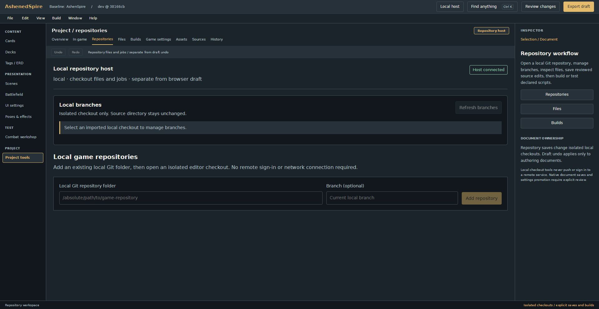

# Account pause verification

The October 1 user correction pauses Account, owner setup, login, logout and password UI. The editor opens directly. Automatic loopback sessions protect local checkout operations; previous account stores are not opened or changed. Public static builds keep draft authoring and isolated previews without local host access.

Changes were integrated separately from concurrent scene/card work on `f09a2d1f9ff74bb75ab6812bb06cc838a0525a1f` (`origin/dev`) in a D: worktree. Renewed local sessions refresh checkout tokens while retaining authoring and file buffers. Settings promotion loses its review when its local session changes. Windows import retries only EPERM/EACCES on the validated staging rename, rechecks its private parent and refuses occupied targets; retry budget is six waits totaling 5.85 seconds.

Verification on that isolated tree:

- Focused auth, reconnect, checkout, native-document, branch, GitHub-backend and host tests: 32 passed.
- Full `npm test`, quick source review (92 source files), normal production/Sites build and feature-to-dev branch policy: passed.
- Consolidated Pages build and asset checks passed with `/AshenedSpire-Editor/test/account-pause-review/`: 55,043,638 bytes, 5,216 embedded resources.
- Root independent source review found no actionable blocker. Browser check at local port 5176 opened authoring directly, refreshed Local host, opened connected repository tools, displayed no account form and reported a clean console.
- The original local checkout also passed a real isolated import within its private `.workbench` folder, a revision-checked save, source preservation, actual build output and private-path 404 checks.

Existing dormant password/GitHub backend libraries remain for explicit hosts and regression fixtures. The paused editor exposes no account UI. This receipt does not claim remote publication; CI and Pages workflow results must be checked for the reviewed commit before promotion is reported as live.
